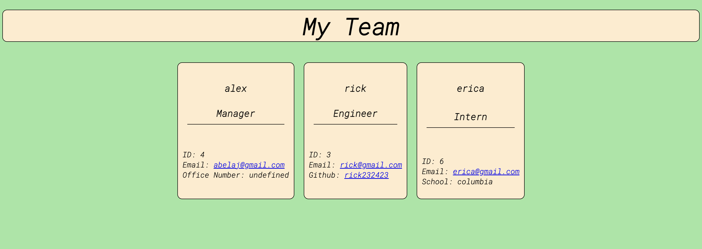

# TeamBuilder
Node.js command-line application that takes in information about employees on a software engineering team and generates an HTML webpage that displays summaries for each person.

## Table of Contents
* [Video](#video)
* [Technologies](#technologies)
* [Installation](#installation)
## Video

[CLICK HERE FOR APPLICATION VIDEO WALKTHROUGH](https://drive.google.com/file/d/1DCkOQyeyCwZhuy1EtcViEWaREZvTEwFu/view?usp=sharing)

## Technologies

* Inquirer
* Jest 
* Node
* HTML
* CSS
* JavaScript

## Installation
* npm install
* npm install jest

